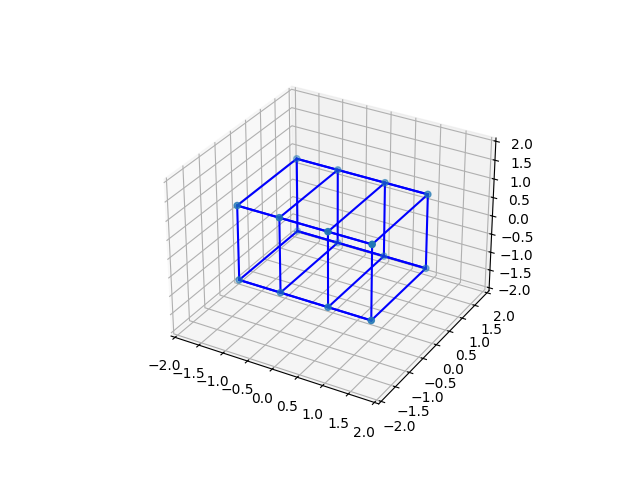
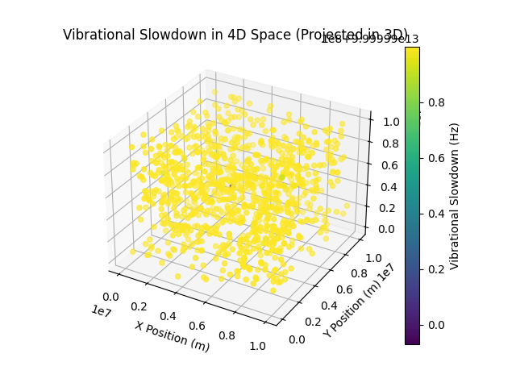
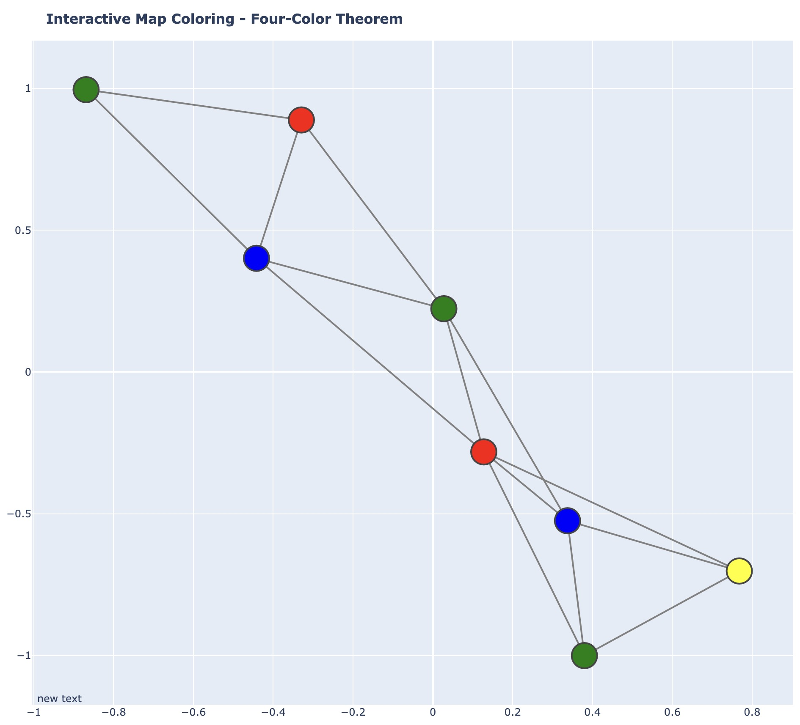
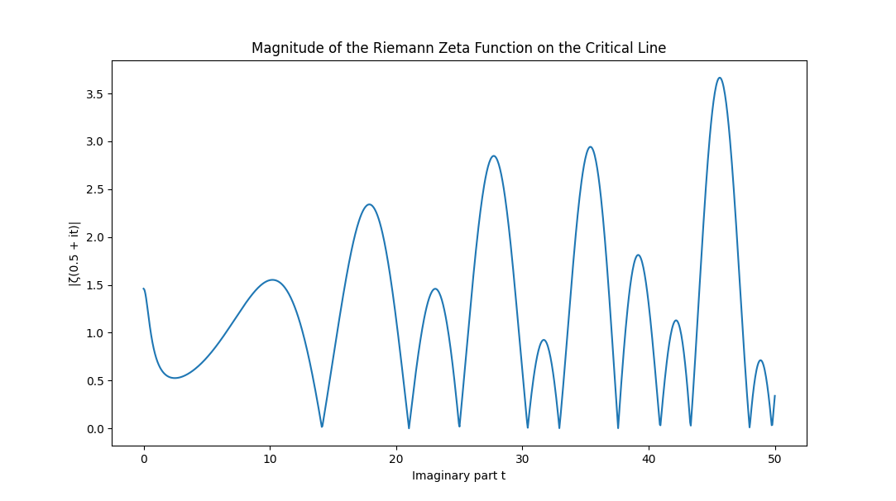
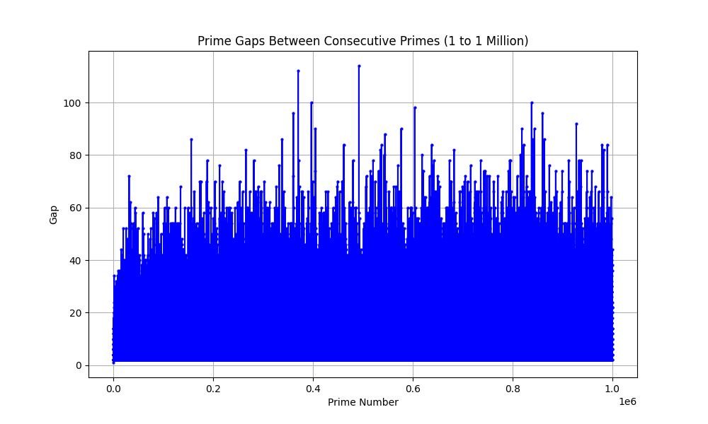
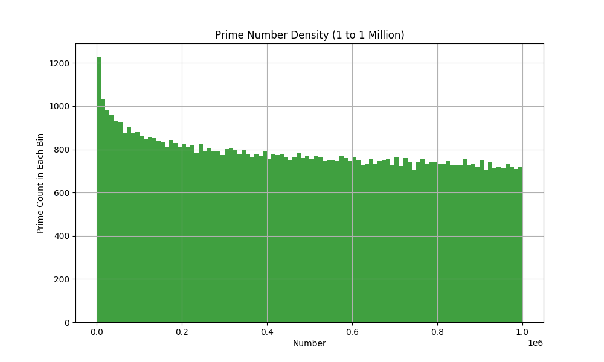
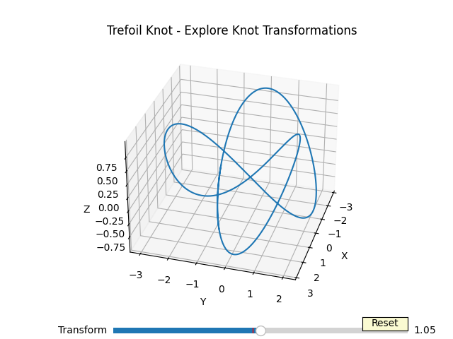
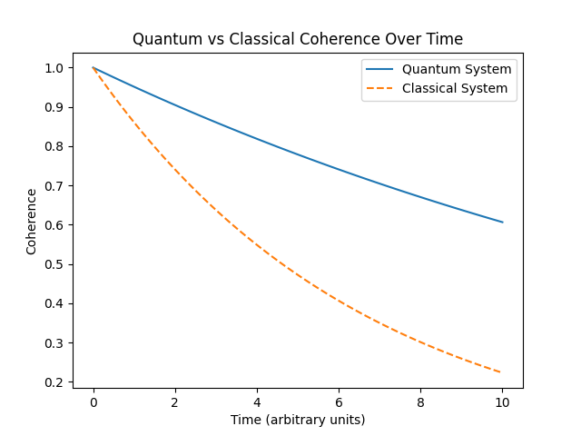

# 🧠 Mathematical Visualizations and Explorations

Welcome to the **Mathematical Universe**! 🌌 This repository contains various Python scripts and visualizations related to advanced mathematical topics like **prime number distribution**, **graph theory**, **four-dimensional geometry**, and **cosmology**. Each script and asset has been designed to offer an interactive or visual representation of complex mathematical ideas...

## 📂 Directory Overview

### 4D Geometry 🌀

- **`4d_as_color.py`**: Visualizes four-dimensional data using colors to represent the additional dimension.
- **`4d_hypercube.py`**: Simulates the visualization of a hypercube in 4D space.
- **`4d_rotation_animation.py`**: Animates a 4D object rotating through different axes.
- **`4d_rotation.png`**: A snapshot of the 4D rotation animation.

  

- **`4d_vibrational_slowdown.png`**: A visual representation showing the effects of slowing down vibrational data in a 4D context.

  

### Quantum Coherence & Decay 🎶

- **`coherence_decay_viz.py`**: Visualizes the decay of coherence over time in a quantum system.
- **`coherence_lean.md`**: A markdown file that explains the mathematical foundation of coherence and its decay in quantum systems.
  
### Four-Color Theorem 🎨

- **`four_color_theorem_v2.py`**: An enhanced script that visualizes the Four-Color Theorem, ensuring that no two adjacent regions in a map share the same color.
- **`four_color_theorem.png.jpeg`**: A rendered image showing an example of the Four-Color Theorem in action.

  

- **`four_color_theorem.py`**: The original script exploring the Four-Color Theorem using graph theory.

### Knot Theory 🔗

- **`knots_tangles_and_the_jones_polynomial.py`**: Explores the relationship between knots, tangles, and their respective Jones polynomials through 3D visualizations.

### Riemann Zeta Function & Prime Distribution 🧮

- **`magnitude_of_riemann_zeta_function_on_critical_line.png`**: A plot showing the magnitude of the Riemann zeta function along the critical line.

  

- **`riemann_prime_distribution.py`**: An interactive 3D visualization exploring the distribution of prime numbers and their relationship to the Riemann Hypothesis.
- **`riemann_zeta_function.py`**: Computes the zeros of the Riemann Zeta Function and relates them to prime number distributions.

### Cosmology & Perelman's Solution 🌍

- **`perelmans_solution.py`**: A Python script visualizing Perelman's proof of the geometrization conjecture through 3-manifolds.
- **`perelmans_webgl.html`**: A WebGL-based visualization showcasing Perelman's geometrization solution.
- **`universe_geometry.py`**: Explores different geometries of the universe post-Big Bang (hyperbolic, Euclidean, spherical).

### Prime Number Analysis 📈

- **`prime_gaps_between_consecutive_primes_1_to_1_million.png`**: A graph depicting the gaps between consecutive prime numbers up to 1 million.

  

- **`prime_number_density.png`**: A visual representation of the density of prime numbers in different intervals.

  

- **`prime_number_distribution.py`**: A script visualizing the distribution of prime numbers on a large number line, highlighting prime gaps.

### Twin Primes 🔢

- **`twin_prime_conjecture.py`**: Explores the famous twin prime conjecture and provides an interactive way to experiment with prime gaps and bounded prime pairs.

### Vibrational Physics & Lorentz Factor 🌌

- **`vibrational_lorentz_factor.py`**: Simulates the behavior of vibrational systems influenced by the Lorentz factor in relativistic settings.
- **`4d_vibrational_slowdown.png`**: A visual that explores the impact of deceleration on vibrational frequencies in 4D space.

### Thurston's Geometries 🔵⚫

- **`thurston_geometries.py`**: Simulates different geometric structures related to Thurston's eight 3D geometries.
- **`thurston_programme_explanation.md`**: An explanation of Thurston's geometrization program and its implications for 3-manifolds.

### Trefoil Knots ⚔️

- **`trefoil_knot_transformations.png`**: A 3D visualization of trefoil knots and their transformations in space.

  

### Time Slider ⏳

- **`time_slider.py`**: A time-based slider visualization tool that allows users to explore changes in mathematical models or physical simulations over time.

### Quantum vs. Classical Coherence 📉

- **`quantum_vs_classical_coherence_over_time.png`**: A comparative visualization showing how quantum coherence behaves differently from classical coherence over time.

  

